<!-- ============ CABEÇALHO ============ -->

  

  

  

<!-- ============ WHOAMI ============ -->
<h3 align="center">── <code>whoami.exe</code> ──</h3>

<table align="center">
  <tr>
    <td align="center" width="170">🔍 <b>Entendo</b> o problema de verdade</td>
    <td align="center" width="170">📊 <b>Analiso</b> os dados</td>
    <td align="center" width="170">⚙️ <b>Melhoro</b> o processo</td>
    <td align="center" width="170">🚀 <b>Entrego</b> a solução</td>
  </tr>
</table>

<!-- ============ STACK ============ -->
<h3 align="center">── <code>stack.exe</code> ──</h3>

  

<!-- ============ ABOUT ============ -->
<h3 align="center">── <code>about.exe</code> ──</h3>

  

<!-- ============ STATS ============ -->
<h3 align="center">── <code>stats.exe</code> ──</h3>

  
  

  

<!-- ============ CONTATO ============ -->
<h3 align="center">── <code>contact.exe</code> ──</h3>

  
  

Tem um processo travado? Me chama. ⚙️

<!-- ============ RODAPÉ ============ -->

  

